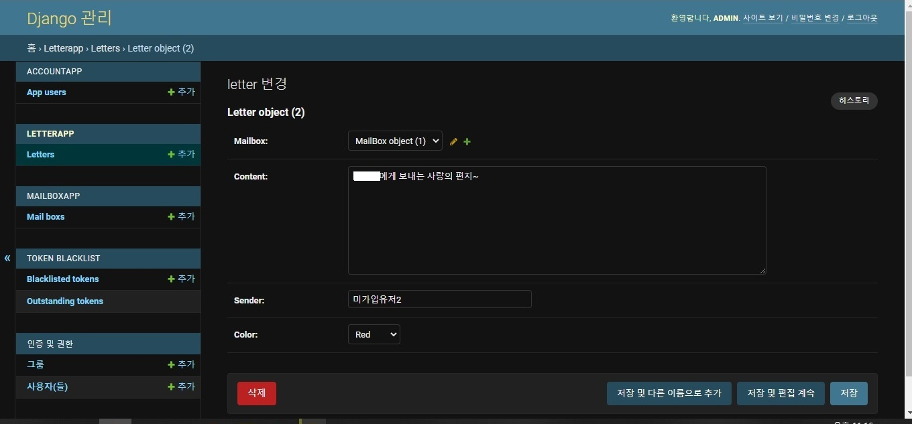
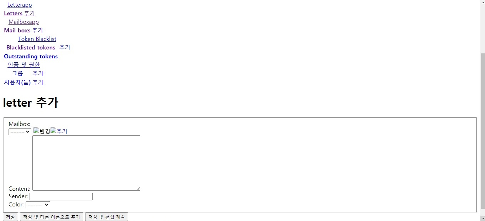
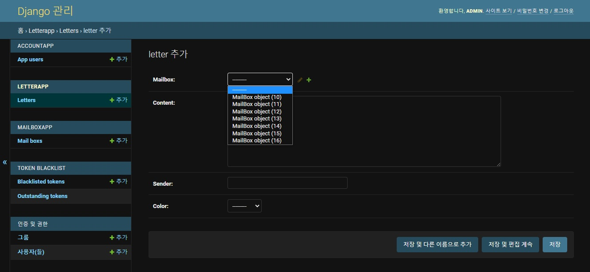

# Docker 배포 환경에서 django admin 페이지에 css 적용

> 참고 : [실용주의 프로그래머](https://www.youtube.com/channel/UCmm6VRoi59BUHDPoa3k4VPw/videos)


## 문제 상황

해당 프로젝트는 크게 3종류의 container가 구동되고 있다. 

1. `django_container_gunicorn` 
2. `mariadb_container`
3. `nginx_container`

`[IPaddress]/admin` url로 nginx 컨테이너에게 admin 페이지를 요청하게 되면, 아주 못생긴 화면을 받게 된다.

- local에서의 장고 admin 페이지의 모습

   

  ​

  

- 배포 환경에서 보이는 장고 admin 페이지 모습

  

사용자에게 보여주는 페이지도 아니니 그냥 써도 되지 않을까? 정도껏 못생기면 참고 사용하겠지만.. 개발자가 이용하기에도 불편할 정도의 흉물스러움이라 생산성을 떨어뜨리는 수준이라면, 조금 수고롭더라도 바꿔주어야 맞겠다.


## 왜 이런일이?

### webserver의 역사

태초의 webserver은 *.html 파일같은 단순한 static 파일만을 전달하였다. 시간이 지나 "현재 인기글 상위 10개를 보여주라"와 같은 동적(dynamic)인 쿼리에 대응해야 했다. 서버에서 동적인 컨텐츠를 생산해야 하는 것이다. 초기에는 server가 static 컨텐츠와 dynamic 컨텐츠 모두를 생산, 전달하였지만 점점 요구가 복잡해지다보니 이 둘의 기능을 분리하게 되었다. 즉, 서버단에서 user의 static 컨텐츠 쿼리를 담당하는 중추와 dynamic 컨텐츠 요구를 담당하는 중추가 달라진 것이다. 


### 해당 프로젝트에 대입하자면,

- `nginx_container`: STATIC 컨텐츠 처리
- `django_container_gunicorn` : DYNAMIC 컨텐츠 처리

로 기능이 분리된 것이다. 그러니, `django_container_gunicorn` 는 nginx_container에게 동적 컨텐츠만 제공할 뿐, admin 페이지와 관련한 css파일(정적 파일)을 전달하지 못한 것이다.


## Troubleshooting

 해결방향은 다음과 같다.

1. django에서 static한 파일들(`*.css`, `*.html` 등)을 **수집**
2. django에서 수집한 static 파일들을 `nginx_container`와 **동기화**


먼저, 

### 1. django에서 static한 파일들(`*.css`, `*.html` 등)을  수집

- `settings/base.py` 에 추가

  (settings.py를 settings 디렉토리로 바꾸고 base.py, local.py, deploy.py로 분리하면서, 로컬환경에서의 수행과 배포 환경에서의 수행을 각각 할 수 있도록 관리하였음)

```python
... (생략) ...

# Static files (CSS, JavaScript, Images)
# https://docs.djangoproject.com/en/3.2/howto/static-files/

STATIC_URL = '/static/'

STATIC_ROOT = os.path.join(BASE_DIR, 'staticfiles')

STATICFILES_DIRS = [
    BASE_DIR / "static",
]

... (생략) ...
```

`STATIC_ROOT`에 할당된 경로에 장고 프로젝트 내에 존재하는 모든 static file들을 모을 것이다. 해당 프로젝트는 API 서버 구축이므로, static 폴더에 개인적인 정적 파일들이 없어서 `dummy.css`를 추가하였다. (`static` 디렉토리에 더미 파일을 추가하지 않으면 오류가 생김)

다음의 명령을 입력하게 되면, `STATIC_ROOT` 경로에 지정된 `staticfiles` 라는 폴더에 모든 정적파일들이 모여들게 된다.

```shell
python manage.py collectstatic
```


문제는 이를 로컬환경이 아닌 서버에서 해줘야 하는 것이다. 

1. **배포환경에서**
2. **Dockerfile을 이용하여**

위의 명령을 수행해야 한다. 


- Dockerfile 마지막 CMD 수정

```dockerfile
... (생략) ...

CMD ["bash", "-c", "python manage.py collectstatic --settings=BACKEND.settings.deploy --no-input"]
```

(뒤에 runserver 관련 커맨드는 생략하였다.) `--settings=` 은 앞의 명령을 배포환경에서 수행하기 위함이고, 뒤의 `--no-input`은 혹여 명령 수행 중에 yes/no를 입력해야하는 부분이 있다면, yes로 자동 입력하게 하는 옵션이다.


###  2. django에서 수집한 static 파일들을 `nginx_container`와 **동기화**

해당 작업을 위해 `nginx.conf` 파일과 `docker-compose.yml` 파일을 수정한다.

- `nginx.conf` 파일에 추가

  ```nginx
  worker_processes auto;

  events {
  }

  http {
    server {
      listen 80;

      include mime.types;

      location /static/ {
          alias /data/static/;
      }

      location / {
          .... (생략) ...
      }
    }
  }
  ```


static으로 요청이 온다면, 컨테이너 내에 `/data/static/` 경로에 static 관련한 `bind volume`을 생성. 반드시 `mime`을 include해야 한다.


- `docker-compose.yml`에 `static-volume` 추가

  ```yaml
  version: "3.7"
  services:
    ngnix:
      image: nginx:1.19.5
      volumes:
        - /home/nginx_setting/nginx.conf:/etc/nginx/nginx.conf
        - static-volume:/data/static ################ 추가 #################
      networks:
        - network
      ports:
        - 80:80

    django_container_gunicorn:
      image: django_test_image:1
      networks:
        - network
      volumes:
        - static-volume:/home/[프로젝트 경로]/staticfiles ################ 추가 #################
      secrets:
        - MYSQL_PASSWORD
        - DJANGO_SECRET_KEY

    mariadb:
      image: mariadb:10.5
      networks:
        - network
      volumes:
        - maria-database:/var/lib/mysql
      secrets:
        - MYSQL_PASSWORD
        - MYSQL_ROOT_PASSWORD
      environment:
        MYSQL_DATABASE: [db 이름]
        MYSQL_USER: root
        MYSQL_PASSWORD_FILE: /run/secrets/MYSQL_PASSWORD
        MYSQL_ROOT_PASSWORD_FILE: /run/secrets/MYSQL_ROOT_PASSWORD

  networks:
    network:

  volumes:
    maria-database:
    static-volume: ################ 추가 #################

  secrets:
    DJANGO_SECRET_KEY:
      external: true
    MYSQL_PASSWORD:
      external: true
    MYSQL_ROOT_PASSWORD:
      external: true
  ```


이렇게 django admin 페이지에서 필요한 css 정적파일들이 `django_container_gunicorn`으로부터 넘어 오지 않아 생기는 문제를 해결하게 된다.

- 속 시원한 화면

