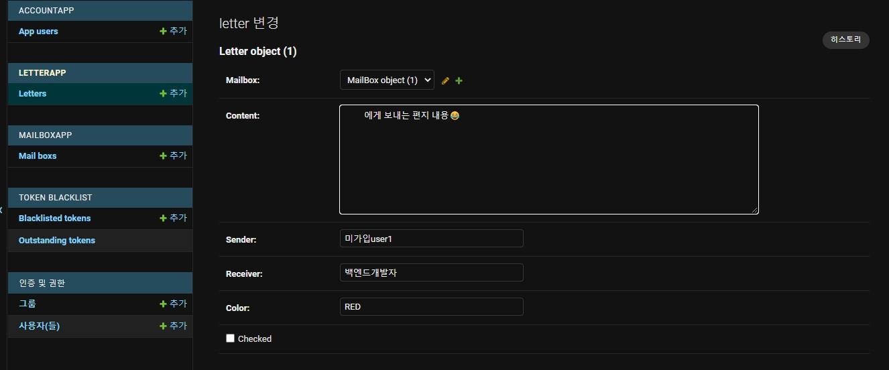

# 해결 방향

-   결국 docker mariadb container 내의 `/etc/mysql/my.cnf` 경로에 원하는 것을 이뤄달라는 설정들을 추가로 적어주고, `docker container restart`을 해주면 되는 간단한 상황이다.

# 문제 상황

-   그런데 문제는 vim으로 해당 파일에 원하는 것을 적고 **`restart`를 하는 순간 이상한 일이** 벌어진다는 것
-   설정을 적용한 `mariadb container A`가 재가동이 되면 되는 것을 `mariadb container A`가 돌연 `stopped` 되고, `mariadb container B`(설정이 적용되지 않음)가 새롭게 `created` 되는 것이다.
-   이 현상을 해결하기 위해 갖은 노력을 했다.  
    ㅤ
    -   portainer에서 restart -> 실패
    -   docker container 내부에서 restart -> 실패
    -   terminal에서 restart -> 실패
    -   docker container restart policy를 건드려 봄 -> 실패
-   어째서 이런 미스테리한 일이 벌어지는 지 알 수가 없어, **stack overflow 형들**에게 도움을 요청했다.
-   [https://stackoverflow.com/questions/69231959/when-i-restart-to-reflect-the-setting-etc-mysql-my-cnf-then-another-contain](https://stackoverflow.com/questions/69231959/when-i-restart-to-reflect-the-setting-etc-mysql-my-cnf-then-another-contain)
-   (형님들 많이 바쁘셔서 무플ㅜ)


# 트러블슈팅

-   방향을 바꿔 **서버 `/home`에 내가 원하는 내용을 적은 `my.cnf` 파일을 생성하고, 이를 container 내부 `/etc/mysql/my.cnf`와 동기화**하는 방식으로 전략을 바꿈
-   \-> **성공** (다른 개발자가 큰 힌트를 주어서 알게됨. 왜 이걸 생각하지 못했을까.. 'restart만 되면 되는데..!'에 너무 꽂혀버려서 그런듯하다. 경계해야될 태도)

-   방법은 간단하다.

> `my.cnf`

```
.
.
(생략)
.
.
# Import all .cnf files from configuration directory
[mariadbd]
skip-host-cache
skip-name-resolve

# about emoji
collation-server=utf8mb4\_unicode\_ci
character-set-server=utf8mb4
skip-character-set-client-handshake
```

를 작성해서 서버 적당한 디렉토리 내에 업로드. 본인은 `/home/mariadb_setting` 디렉토리에 올림.

이를 docker container 내부의 `/etc/mysql/my.cnf`와 동기화 한다는 내용을 `docker-compose.yml` 파일에 적어줌

> `docker-compose.yml`

```
.
.
(생략)
.
.
  mariadb:
    image: mariadb:10.5
    networks:
      - network
    volumes:
    ####################### 여기 #######################
      - /home/mariadb_setting/my.cnf:/etc/mysql/my.cnf
      - maria-database:/var/lib/mysql
    secrets:
      - MYSQL_PASSWORD
      - MYSQL_ROOT_PASSWORD
    command: --lower_case_table_names=0
    environment:
.
.
(생략)
.
.
```


stack build하면 끝! 

