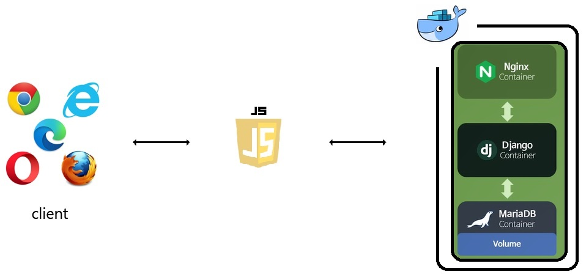

# About PoppyMail📬


PoppyMail📬은 개개인의 우체통에 다른 사람이 작성한 온라인 편지를 담아 랜덤 날짜에 확인하는 온라인 웹 서비스 입니다.

## 🔗 링크
▶️ [POPPY-MAIL](!https://poppy-mail.vercel.app/)   
▶️ [POPPY Instagram](!https://www.instagram.com/poppy.mail_/?utm_medium=copy_link)

## ✔️ 역할
|이름   |github                   |담당 기능|
|-------|-------------------------|--------------------|
|박세원 |[sw-develop](https://github.com/sw-develop) | 모델링 및 Django ORM을 사용해 MariaDB와 연동, JWT 인증 기반 카카오톡 소셜 로그인 구현, 우체통 CRUD 구현 |


## ✔ ️사용 기술 및 tools
> - Back-End :  &nbsp;&nbsp;&nbsp;
> - Deploy : &nbsp;
> - ETC :  &nbsp;&nbsp;


## ✔️ 모델링


## ✔️ 서버 구성


## ✔️ 주요 화면
     
 

## ✔️Prerequisite
- Make a virtual environment

  ```shell
  $ cd BACKEND
  $ python3 -m venv venv
  ```

- Run a virtual environment

  ```shell
  C:\Users\Name\poppy> venv\Scripts\activate
  ```

- Install requirements

  - install requirements

    ```shell
    (venv) ~$ pip install -r requirements.txt
    ```

  - pip upgrade

    ```shell
    (venv) ~$ python3 -m pip install --upgrade pip
    ```

    ​

## ✔️Usage
```
(myvenv) ~/BACKEND$ python manage.py makemigrations
(myvenv) ~/BACKEND$ python manage.py migrate
```

```shell
(myvenv) ~/BACKEND$ python manage.py runserver
```

