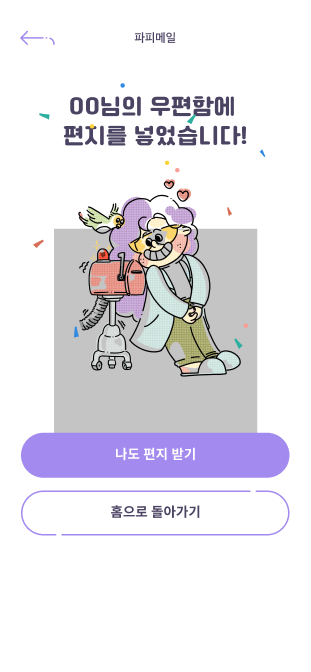

# POPPY MAIL proj

> 주의 : local 환경에서는 
>
> 1. `BACKEND/settings/__init__.py`에서 **from .local import** 로 수정
> 2. `accountapp/views.py`에서 **from BACKEND.settings.local import SECRET_KEY**로 수정
>
> 주의 : 배포 환경에서 superuser 생성하기
>
> 1. (AWS 서버라면) pem key 이용하여 username **ubuntu**로 접속
> 2. 장고 컨테이너에 접속 : **sudo docker exec -it [장고 컨테이너 이름] /bin/bash**
> 3. 배포 환경에서 관리자 생성 : **python manage.py createsuperuser --settings=BACKEND.settings.deploy**

## Description

- 친구들의 편지를 랜덤한 날짜에 받아볼 수 있는 서비스


## Environment


## Prerequisite

- Make a virtual environment

  ```shell
  $ cd BACKEND
  $ python3 -m venv venv
  ```

- Run a virtual environment

  ```shell
  C:\Users\Name\poppy> venv\Scripts\activate
  ```

- Install requirements

  - install requirements

    ```shell
    (venv) ~$ pip install -r requirements.txt
    ```

  - pip upgrade

    ```shell
    (venv) ~$ python3 -m pip install --upgrade pip
    ```

    ​

## Usage

```
(myvenv) ~/BACKEND$ python manage.py makemigrations
(myvenv) ~/BACKEND$ python manage.py migrate
```

```shell
(myvenv) ~/BACKEND$ python manage.py runserver
```


## Service imgs




